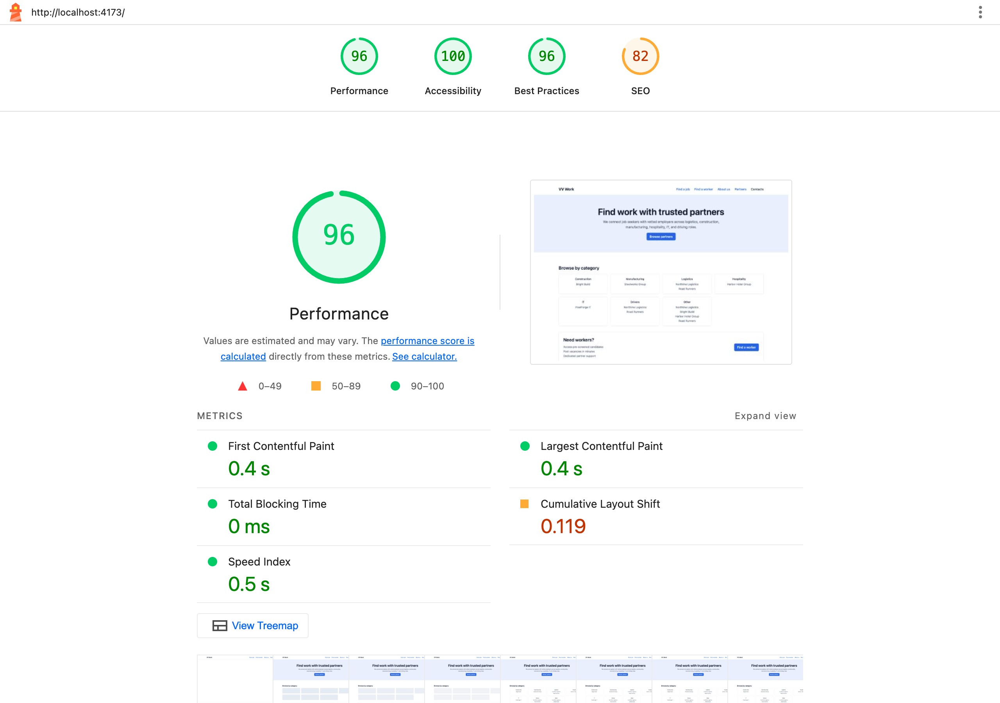

# VV Work

VV Work is a job-matching platform for workers and employers in Europe. This repository is a frontend test assignment: a public homepage, a dynamic partner/employer page with a searchable, filterable vacancy list, and a contacts page with an application form.

## Stack

Vite + React 19 + TypeScript (strict) + Tailwind CSS v4 + React Router + Vitest + Testing Library + ESLint + Prettier.

No UI kit, no Redux/Zustand — state management is explained below.

## Getting started

```bash
npm install
npm run dev         # local dev server
npm run build        # production build
npm run preview      # preview production build
npm run test         # unit tests (Vitest)
npm run test -- --coverage
npm run lint
npm run typecheck
npm run format
```

## Architecture

```
src/
  app/            # RouterProvider, route definitions, lazy-loaded pages
  api/            # mock API layer: client.ts (mockFetch), partners.ts, vacancies.ts, applications.ts, types.ts
  data/           # local JSON "backend": partners.json, vacancies.json, categories.json
  hooks/          # useAsyncResource (status/data/error/retry), useDebouncedValue
  components/
    layout/       # Header, Footer, PageLayout, Container
    ui/           # Button, Input, Textarea, Skeleton, ErrorState, EmptyState — shared primitives
    vacancies/    # VacancyFilters, VacancySearchInput, VacancyList, VacancyCard
    forms/        # ApplicationForm (contacts page)
  pages/          # HomePage, PartnerPage, ContactsPage, NotFoundPage
  lib/            # pure helper functions (format.ts, validation.ts, phoneMask.ts)
```

There is no backend: `api/client.ts` exposes a single `mockFetch(loader, opts)` wrapper that simulates a real network call — random 300–800ms latency, a ~1-in-5 chance of a 500 error, and `AbortSignal` support — around synchronous reads of the local JSON files in `data/`. `getPartnerBySlug`, `getPartners`, and `getVacancies` are the only functions that touch that layer.

## My decisions

1. **Homepage structure** — Hero (value prop) → category grid → employer CTA → partner list, in that order of narrowing intent: a visitor who already knows what they want skips straight to a category card; the employer CTA sits mid-page as a secondary audience break rather than competing with the primary "browse partners" action in the hero; the full partner list is last, for whoever wants to browse everyone instead of filtering by category.
2. **Getting to a relevant vacancy faster** — category cards on the homepage deep-link straight to `/partners/:slug?category=slug`, landing on the partner page pre-filtered; from there, search and category both write to the same URL (`useSearchParams`), so the two filters compose instead of fighting each other, and the resulting link is shareable/bookmarkable and survives back/forward navigation.
3. **State management without Redux/Zustand** — three levels (local `useState` → `useSearchParams` → `useAsyncResource`), because nothing needs to survive navigation or be shared between unrelated components — a global store would only add indirection. `VacancyFilters` is the only writer to `useSearchParams`; `PartnerPage` only reads.
4. **Fighting unnecessary re-renders** — the search input writes to the URL instantly (cheap), while the expensive filtering runs off a debounced value via `useMemo`. That alone isn't enough: `VacancyList` itself must be wrapped in `memo` (not just `VacancyCard`) for the stable filtered array to actually stop the list from re-rendering on every keystroke — verified with a render counter.
5. **What changed from the brief, and why** — see [Deviations from the brief](#deviations-from-the-brief) below.

## Deviations from the brief

- **Phone *or* Telegram, not phone *and* Telegram** — the brief lists both as required fields; read literally that would block a candidate who only has one contact channel, so the form requires at least one of the two rather than both (`src/lib/validation.ts`).
- **Live input masks for phone/Telegram** — beyond the brief's plain validation ask, both fields format as you type (grouped digits, a pinned `@handle`) with cursor-safe caret positioning (`src/lib/phoneMask.ts`, `src/lib/telegramMask.ts`), so the raw pattern requirement is easier to satisfy correctly.
- **Lower error rate for the homepage's category loader** — `mockFetch`'s default ~20% error rate is per-call; the category grid fans out into N+1 calls (all partners, then each partner's vacancies), which would compound to a near-certain failure. That loader uses a 3% rate instead (`src/pages/HomePage.tsx`) so the section is still usable as a demo while every other resource keeps the brief's default rate.
- **No Figma, so visual direction was a first-party decision** — CSS-variable design tokens over Tailwind, one accent color plus a neutral scale, a `clamp()`-based type scale, and visible focus states everywhere; documented as a deliberate choice rather than an oversight since the brief explicitly left this open.

## Lighthouse

Performance 96 / Accessibility 100 / Best Practices 96 / SEO 82, measured against `npm run build && npm run preview` (desktop preset). FCP 0.4s, LCP 0.4s, TBT 0ms, CLS 0.119.



The homepage's hero is plain text on a system font stack (no web fonts to preload) and the app has no `` elements yet, so there's nothing to add `fetchpriority` or explicit dimensions to. Each page (`HomePage`, `PartnerPage`, `ContactsPage`, `NotFoundPage`) is already code-split via `React.lazy` in `src/app/routes.tsx`, which keeps the initial JS payload down to the shared vendor chunk plus whichever page is active.

The homepage's two async sections (category grid, partner previews) reserve a `min-h` matching their own skeleton's height (`src/pages/HomePage.tsx`), so an error state or a shorter/taller success render doesn't yank the footer around — this brought CLS down from 0.85 to 0.12. Mobile's headless-CLI Lighthouse run is noisy on this environment (a Chrome-for-Testing rendering artifact, reproducible even on an untouched build) and shouldn't be trusted over a direct run from Chrome DevTools.

## Accessibility

`npx @axe-core/cli` against all three routes (`/`, `/partners/:slug`, `/contacts`) with the `wcag2a`/`wcag2aa`/`wcag21a`/`wcag21aa` rule sets: **0 violations**. Lighthouse's accessibility audit initially flagged one serious issue — the hero paragraph's `text-muted` color at 4.13:1 contrast against the tinted `bg-accent/10` background, short of the 4.5:1 required for normal text — fixed by darkening `--color-muted` (`src/index.css`), which also improved contrast everywhere else the token is used. Lighthouse Accessibility is now 100.

## Testing

Unit tests (Vitest + Testing Library) cover the logic the brief calls out specifically: `mockFetch`'s latency/error/abort behavior, `useAsyncResource`'s status transitions and cancellation-on-unmount, `useDebouncedValue`'s collapsing of rapid updates, and the vacancy filtering/search flow end-to-end on `PartnerPage`. `hooks/`, `lib/`, and `api/` each stay well above the brief's 60% statement/branch coverage bar — run `npm run test -- --coverage` to see the current numbers.
